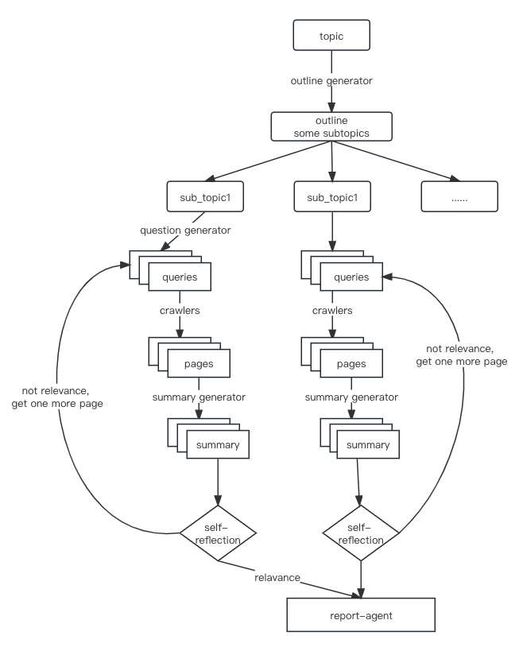

inpired by this project, that's really a great job.

https://github.com/assafelovic/gpt-researcher

## changes

Yet I wanted sth more, so I spent a few days refactoring that project, mainly including:

1. Serializing all steps with a pipeline object, you can find it in pipeline/pipeline.py.
2. Added proxy server related settings, which are obviously valuable for some regions...may be the most import improvement I'v done here, haha...
3. Refactored the crawler part to make it easier for people with programming basics to add more specific website dedicated crawlers. You can even develop a "crawler" that reads local files, providing pre-prepared materials for subsequent steps, instead of using less controllable network data.
4. Before starting the retrieval and crawler steps, the report outline was first generated using LLM, and the subsequent retrieval and crawling were all around this outline, significantly improved the relevance of the retrieved content and the final report.
5. Added introspection mechanism, the content of the crawled page will first use LLM to judge the relevance to the final report, and irrelevant documents will be discarded. This feature improves the relevance between the input materials and the final report. Specifically, I also found the timeliness issue of search results, so I require the introspection mechanism to automatically discard potentially outdated documents.
6. I saved all the intermediate results, so when any error occurs, you can correct the bug and restart the task, and the task will continue directly from where it was interrupted, without having to start from scratch.
7. Added statistics for token usage and token usage price.
8. Added native language indication in all prompts, therefore, the language used in the final report is always consistent with the language of the user's question. Tested with Chinese and English.

NO WEB UI... I guess this is too difficult for me...

All you need to do is rename config/config.private.template.json to config/config.private.json and provide your own GPT token.

```shell
git clone git@github.com:godisboy0/gpt-researcher.git
cd gpt-researcher
cp config.private.template.json config.private.json 
```

## Architecture




## Example

here is an exaample for topic: How to evaluate Alfred Hictchcock and his movies?

### role prompt

```json
{
      "agent": "🎬 Film Critic Agent",
      "agent_role_prompt": "You are a knowledgeable AI film critic assistant. Your main task is to provide comprehensive, insightful, unbiased, and well-structured film reviews and analyses. This includes evaluating the work of directors, such as Alfred Hitchcock, based on their filmography, style, influence, and contribution to the film industry."
}
```

### outline

```json
{
    "topic": "How to evaluate Alfred Hictchcock and his movies?",
    "top_heading": "# How to evaluate Alfred Hitchcock and his movies?\n\nTo generate a comprehensive research report on Alfred Hitchcock and his filmography, follow the instructions below:",
    "outline_propmt": "# How to evaluate Alfred Hitchcock and his movies?\n\nTo generate a comprehensive research report on Alfred Hitchcock and his filmography, follow the instructions below:\n\n## Introduction--200 words\n    - Begin with a brief introduction about Alfred Hitchcock. Include details such as his birth, early life, and entry into the film industry. Also, provide a short overview of his career and major achievements.\n\n## Filmography--1000 words\n    - Provide a detailed overview of Hitchcock's filmography. Discuss some of his most notable films, their plots, and their impact on the film industry. Remember to warn readers about potential spoilers in this section.\n\n## Directing Style--800 words\n    - Analyze Hitchcock's unique directing style. Discuss his use of suspense, his visual storytelling techniques, and his innovative use of sound and music. Include examples from his films to illustrate these points.\n\n## Influence and Legacy--800 words\n    - Discuss Hitchcock's influence on the film industry and his legacy. Include information about filmmakers who have been influenced by his work and how his films have shaped the thriller and suspense genres.\n\n## Critical Reception--500 words\n    - Analyze the critical reception of Hitchcock's films. Include information about the ratings and reviews his films received from major film critics and review aggregators like Rotten Tomatoes and IMDb.\n\n## Awards and Honors--200 words\n    - Discuss the awards and honors Hitchcock received during his career. Include details about his Academy Award nominations and his knighthood.\n\n## Conclusion--200 words\n    - Summarize the main points discussed in the report. Provide a balanced conclusion about Hitchcock's overall contribution to the film industry and his standing as one of the greatest directors of all time.",
    "sub_topics": [
        {
            "topic": "How to evaluate Alfred Hictchcock and his movies?",
            "sub_topic": "##Introduction--200 words",
            "describe": "- Begin with a brief introduction about Alfred Hitchcock. Include details such as his birth, early life, and entry into the film industry. Also, provide a short overview of his career and major achievements.",
            "word_suggestion": 200
        },
        {
            "topic": "How to evaluate Alfred Hictchcock and his movies?",
            "sub_topic": "##Filmography--1000 words",
            "describe": "- Provide a detailed overview of Hitchcock's filmography. Discuss some of his most notable films, their plots, and their impact on the film industry. Remember to warn readers about potential spoilers in this section.",
            "word_suggestion": 1000
        }
      // ......
    ],
    "conclusion": {
        "topic": "How to evaluate Alfred Hictchcock and his movies?",
        "sub_topic": "##Conclusion--200 words",
        "describe": "- Summarize the main points discussed in the report. Provide a balanced conclusion about Hitchcock's overall contribution to the film industry and his standing as one of the greatest directors of all time.",
        "word_suggestion": 200
    }
}
```

### Queries for subtopics

just some of those

```json
{
    "How to evaluate Alfred Hictchcock and his movies?:::##Introduction--200 words": {
        "sub_topic": {
            "topic": "How to evaluate Alfred Hictchcock and his movies?",
            "sub_topic": "##Introduction--200 words",
            "describe": "- Begin with a brief introduction about Alfred Hitchcock. Include details such as his birth, early life, and entry into the film industry. Also, provide a short overview of his career and major achievements.",
            "word_suggestion": 200
        },
        "expanded_question": [
            "Alfred Hitchcock biography",
            "Alfred Hitchcock career overview and major achievements"
        ]
    }
}
```

### Query results

```json
{
  "Alfred Hitchcock biography": [
        {
            "url": "https://en.wikipedia.org/wiki/Alfred_Hitchcock",
            "title": "Alfred Hitchcock - Wikipedia",
            "abstract": "(Top) 1Biography Toggle Biography subsection 1.1Early life: 1899-1919 1.1.1Early childhood and education",
            "question": "Alfred Hitchcock biography"
        }
    ]
}
```

### Crawled pages

 Really a lot words, not showing here.

### Determin results

```json
{
    "How to evaluate Alfred Hictchcock and his movies?:::##Filmography--1000 words:::910cc8c4b2fb6fc13bfe0d0ff06e1ee7": {
        "content": "Filmography - Alfred Hitchcock\n\nAlfred Hitchcock......",
        "relavance": true
    },
    "How to evaluate Alfred Hictchcock and his movies?:::##Directing Style--800 words:::e93d5c3fb3c55dd38574ad88cc6562a9": {
        "content": "I apologize for the inconvenience, but it seems that the material you provided is inaccessible. However, I can still provide you with a comprehensive analysis of Alfred Hitchcock's directing style based on my knowledge and understanding of his work. Please let me know if you would like me to proceed with that.",
        "relavance": false
    }
  // ......
}
```

### Token usage statistic

```json
{
    "gpt-4-0613": {
        "completion_tokens": 576,
        "prompt_tokens": 2487,
        "total_tokens": 3063,
        "details": [
            {
                "completion_tokens": 83,
                "prompt_tokens": 369,
                "total_tokens": 452
            }
        ]
    },
    "gpt-3.5-turbo-16k-0613": {
        "completion_tokens": 7029,
        "prompt_tokens": 23716,
        "total_tokens": 30745,
        "details": [
            {
                "completion_tokens": 437,
                "prompt_tokens": 2502,
                "total_tokens": 2939
            }
        ]
    },
    "gpt-3.5-turbo-0613": {
        "completion_tokens": 2,
        "prompt_tokens": 1841,
        "total_tokens": 1843,
        "details": [
            {
                "completion_tokens": 1,
                "prompt_tokens": 1048,
                "total_tokens": 1049
            }
        ]
    }
}
```
